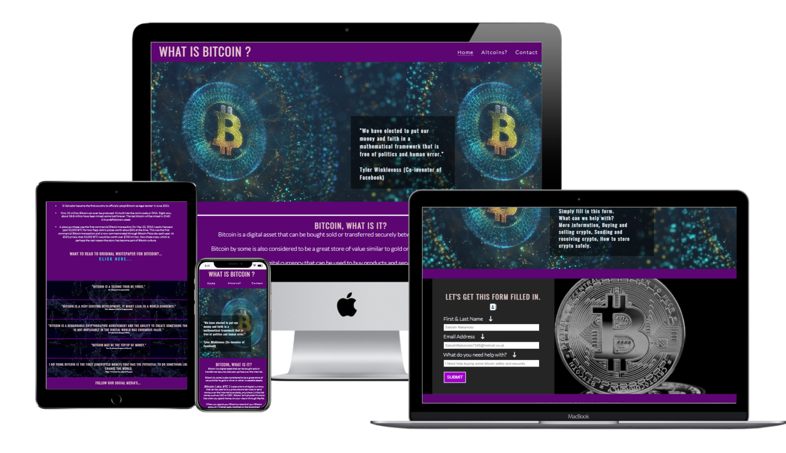
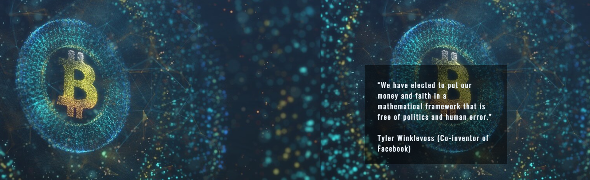
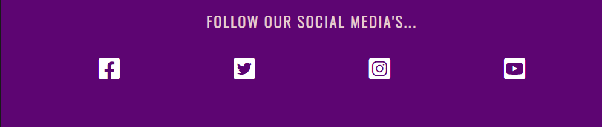
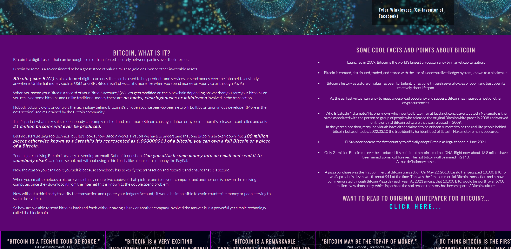
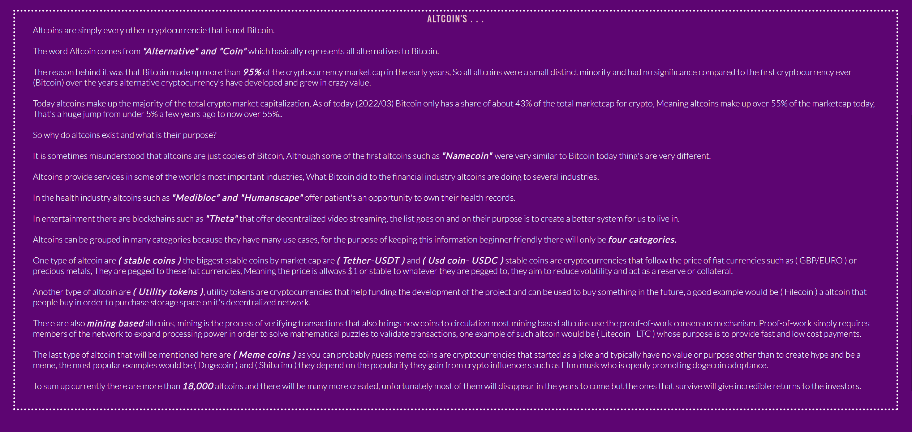
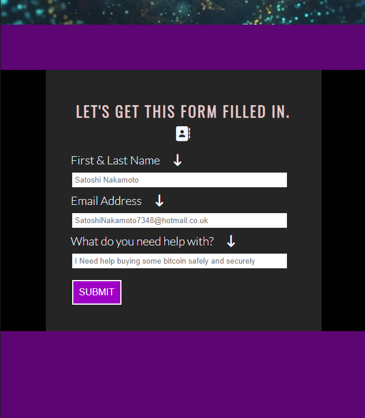
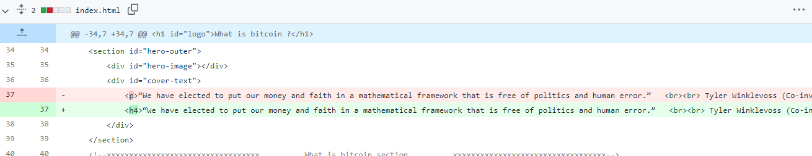
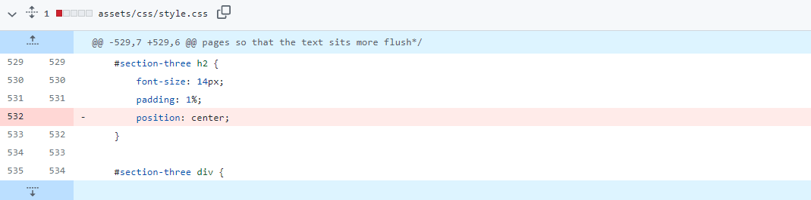
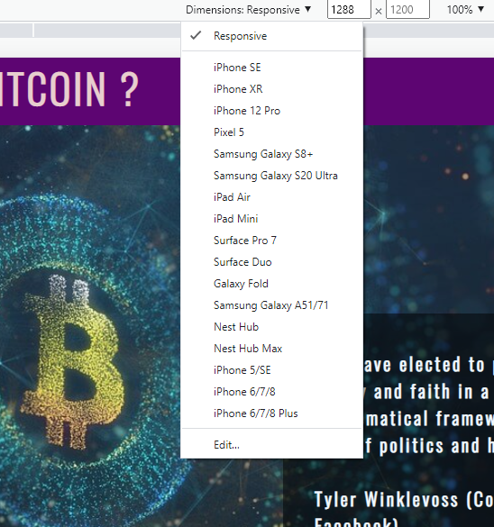
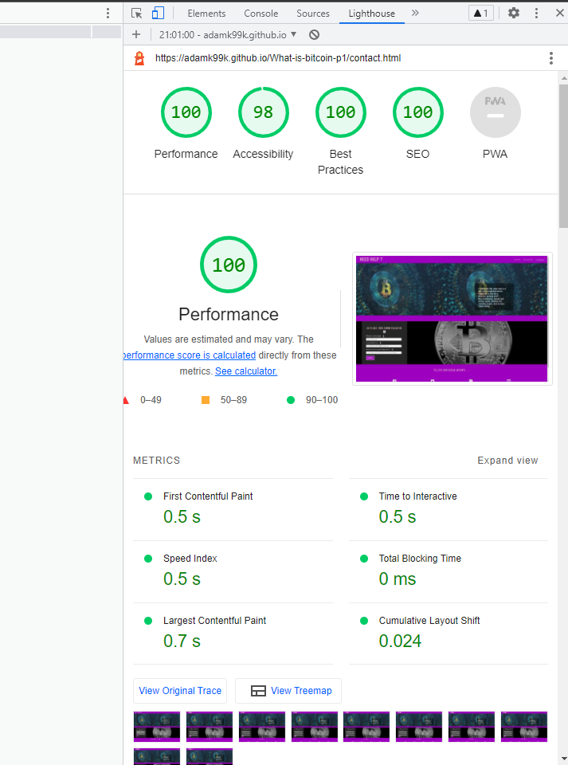

# Time to learn about Bitcoin !

## Hello there and welcome to my first portfolio project for my [Code Institute Course.](https://codeinstitute.net/)

## Want to have a look at my deployed project?   [What is Bitcoin](https://adamk99k.github.io/What-is-bitcoin-p1/)

#

The aim of my site is to simply educate and teach people about what Bitcoin and Altcoins are.  I wanted to create a website that has the main information about Bitcoin and other cryptocurrency without the over-the-top information that is out there on the internet today.   
I decided to make this website with the intent to make it as simple and easy to follow along as possible. To make this idea possible I made three pages to my [What is Bitcoin? Website](https://adamk99k.github.io/What-is-bitcoin-p1/) 
The first page being the home page. This page includes two informational text sections and another section for quotes about bitcoin.  
The second page is about altcoins, this page is made up of just one easy to follow section on altcoins that educate the user. 
The final page is a contact page adding even more value to any user who may have questions.
  
The target audience for my website are all types of people, from the younger generation such as college kids to the older genoration such as perants and grandparents that simply want to learn about bitcoin.
 
The idle user would be someone who has never learned about bitcoin and who is a complete newbie to this space as these users will gain the most value from this site.   

#

# Features

* Title.    Each page shares the same level 1 title. This is Huge Bold text that tells the user exacly what the page is about, this provides clairity for the user.

* Navagation bar.    All three pages have the same navagation bar with three links refering to each page, Home / Altcoins and contact, this allows the user to have easy navigation throghout the website without having to use the back button.

* Hero image.   All three pages have the same Hero Image that has a 10 
seconds Zoom effect when the website is loeaded, This eye catching animation grabs the attention of the user.

#

* Footer section.   Each page's footer section has four links to diffrent social media's, These are large icons so that the user will acknowledge them, for the purpose of this project the links take you to the the landing page for each social media used.

#

* Hero image text.    On all three pages overlaping the hero image is a text section, Each pages text is different but correlated to what each page is about. These sections provide quick value to the user and gives them a feel for the page there about to check out. 

 #

## HOME PAGE

* Clickable link.   On the home page there is a question that asks the user if they want to read the original bitcoin whitpaper, if they do theres a "Click me ..." link that takes you out of the website to the whitepaper site. This grabs the users attention by asking them a question then gives them value by making the whitepaper avivable for them to read.

#

* Quote section.   The Home page's quote section lists five quotes about bitcoin from some of the biggest CEOs and co Ceo's in the world. This section is intresting to the user as familer influential names are taking positvly about the subject there wanting to learn more about, Bitcoin.

#

* Bitcoin, What is it?, Text section.   The text that is within this section is the fundermental basics of Bitcoin, what it is and how it works. The aim of this section is to educate the user on Bitcoin without over complecating things as bitcoin for newbie's can be confusing. This section also becomes scrollible on extra large desktop screens.
* Facts and Points about Bitcoin, Text section.  The aim of this section is to give intresting facts and points about Bitcoin that grab the users attention and fill in some of the questions they may have after reading the first Bitcoin section,such as who Satoshi nakamoto is. There also is a short story of a pizza worth 10,000 BTC, This is a attention grabing story that keeps the user intrested.

## ALTCOINS PAGE

* Altcoins text section.   The Altcoins Page is made up of just one simple text section, This sections aim is to educate the user on altcoins only providing usefull infomation such as what makes up the word "Altcoin" and not providing useless infomation such as a list of all the altcoins there are.

## CONTACT PAGE

* Form :  The contact page has a form section where the user can ask any type of question in regards to all things Crypto. The value of this is that users who are new most deffently have questions they need answeing, So by adding this feature to my site it gives the complete package feeling, Users come, Learn about bitcoin, Then Altcoins then there able to ask anything they want. This encorages the user to ask freely and make's the learning experience more lasting. For the purpose of this project the form dosnt have any action, meaning filled in form's are not sent anywhere but these details once submited do display up in the URL.  

## RESPONSIVE DESIGN
* The whole website has responsive css media queries added that allow users to view it on all device screens such as Large desktop's down to a small iPhone 5 / SE sized screen. This is demonstrated with the image above this features section.

## FEATURES NOT IMPLEMENTED 

* One of the ideas i couldnt inplement is on the home pages quote section i wanted to make the quotes move arround every 10 seconds and switch between other quotes untill the user hoovers over them.

* I also wanted to make the naviagation bar a buttion that users have to click to relise a drop down navagation bar.

* I also wanted to add a button that sticks to the page as the user scrools down that once clicked takes users back up to the navagtion bar.
    The resons i couldnt implemet these were i havnt yet leanrt how to do so.

#
# TESTING MY SITE 
After completing my website i had to test and make sure my code were up to standard and no errors where hidden inside, To do this i first checked Code Validator's for both HTML and CSS then once i checked the validator on each page and fixed the issues i then went on to check lighthouse for a genral report on my site.

## VALIDATOR CODE TESTING.

#### HTML [W3C validator](https://validator.w3.org/) - When running this for the first time there was a few warnings and errors. Here they are with how i solved them.   
* Issue One:  
On the Home page the "Facts and point about bitcoin" section had a un closed < ul > tag, To solve this i added a closing </ ul> tag to line 188 on Index.html.  
* Issue Two :  
Warning: Consider useing h1 elements for top level headings only:   All sections on all pages had a < h1 > heading which there should be only one for the main header heading so to solve this issue i changed all h1 tags on all pages to h2 tags leaving just one h1 on each page for the main header logo text.  
* Issue Three:  
Error: end tag </ nav> seen on line 39 but there was no open < nav> tag. To solve this issue i added a opening < Nav > tag on line 27 on index.html.  
* issue Four:  
Warning : Section id Hero-outer on index.html page lacks heading: To solve this issue i changed the < p > tag to a < h4 >tag, I then did this on all pages , index.html, Altcoins.html and contact.html as this was a warning that came up for all pages.  

* issue Five:    For the < li> elements within the home pages "Facts and points about bitcoin" section i used < br> tags to give line brakes under each < li> element, This wasnt the coorect way to do so and it's not good practice to use < br> tags to space < li> elements. To solve this issue i targeted the < li> elemetns useing css and gave margin to them, This solved the error that was flaged on the httml validator.
#### CSS [CSS Validation](https://jigsaw.w3.org/css-validator/) - When running the css validator for the first time there was only one error.  
* Error:   There was a useless and not effective piece of code in my css, I had a ( position: center; ) rule on line 532 style.css. To solve this i simplely removed the css rule.

#
## TESTING BROWESERS AND RESPONSIVE DESIGN.
### Once my site was finihsed i checked my site works on diffrent web browsers and tested the sites screen size responsiveness. Here are the browsers i tested my site on.

* [Google Chrome](https://www.google.co.uk/chrome/)
 * Browser test :  No issues were found, The site loaded first time as it should.
  * Screen size test :   No issues were found when useing Chromes (   Inspect element ) feature to test diffrent sized screens. The Css media queries work as they should.  
 

* [FireFox](https://www.mozilla.org/en-GB/firefox/features/)
 * Browser test :  No issues were found, The site loaded first time without fault.
  * Screen size test : Useing FireFox's built in developer inspector i used the Responsive design mode and tested diffrent screens sizes out, No issues were found.

* [Microsoft Edge](https://support.microsoft.com/en-gb/microsoft-edge)
 * Browser test :  No issues were found, The site loaded first time.
  * Screen size test :   No issues were found when useing microsoft edges developer tool's to test screen sizes.

* [Brave](https://brave.com/)
 * Browser test :  No issues were found. Site loads.
 * Screen size test :   No issues were found useing developer responsive design tool.

#

## LIGHTHOUSE TESTING
### Once i had tested my site on diffrent browsers and ensured it was responsive on all different screen sizes i generated a Lighthouse within google chrome to identify and fix common problems that effect my sites performance.
 
* The only issue it identified was that theogout my webpage the < em> tags contents were not vissible as much with the backbround i had choose, To solve this i simpley changed the color of < em> tags in css from black to #fff (White). This boosted my lighthouse score, Here is a photo of the finihsed report that i am happy with. 

# TECHNOLOGIES USED.
## [HTML 5](https://en.wikipedia.org/wiki/HTML5)
* Main structure language.
## [CSS](https://en.wikipedia.org/wiki/CSS)
* Main styling language.
## [FONT AWESOME](https://fontawesome.com/)
* Used to get iCons for social media links
## [GITHUB](https://github.com/)
* Used for hosting website and keeping work in a remote place and to deploy my site.
## [GITPOD](https://www.gitpod.io/)
* GitPod was used for the development of my site.
## [TECHSINI](http://techsini.com/multi-mockup/index.php)
* Used to crate a mock up image displaying the the site on diferent screen sizes.
## [TINYPNG](https://tinypng.com/)
* Used to shrink images from online down to smaller sizes making my site faster.
## [BALSAMIQ](https://balsamiq.com/)
* Used for wireframes of my site before i started on it.

#
# DEPLOYMENT

## Before the website was deployed,
I had to use a tempoeary site ( Http.server ) to see the live changes while coding, To do this i used the ( Python3 -m http.server ) command in GitPod and that allowed me to see a live preview of my site while coding.

## The project was deployed on GitHub Pages. 
I used Gitpod as a development environment where I then commited all changes to github, I used (Git commit -m "" ) then (Git push)  command in Gitpod to save chnages to GitHub.
 

## Once my site was ready to deploy online i had to:  
Log in to GitHub and click on repository to deploy (What-is-bitcoin-p1)
select Settings and find GitHub Pages section at the very bottom of the page
from source select none and then change the branch from "none" to "main" then once that was done i click save and the site is deployed after a refresh of the page.
#
# CREDITS