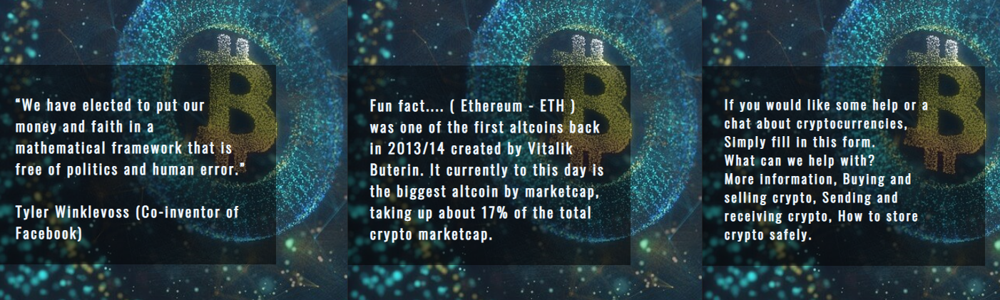
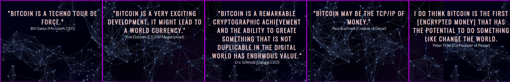

# Time to learn about Bitcoin !

## Hello there and welcome to my first portfolio project for my [Code Institute Course.](https://codeinstitute.net/)

## Want to have a look at my deployed project?   [What is Bitcoin](https://adamk99k.github.io/What-is-bitcoin-p1/)

#

The aim of my site is to simply educate and teach people about what Bitcoin and Altcoins are.  I wanted to create a website that has the main information about Bitcoin and other cryptocurrency without the over-the-top information that is out there on the internet today.   
I decided to make this website with the intent to make it as simple and easy to follow along as possible. To make this idea possible I made three pages to my [What is Bitcoin? Website](https://adamk99k.github.io/What-is-bitcoin-p1/) 
The first page being the home page. This page includes two informational text sections and another section for quotes about bitcoin.  
The second page is about altcoins, this page is made up of just one easy to follow section on altcoins that educate the user. 
The final page is a contact page adding even more value to any user who may have questions.
  
The target audience for my website are all types of people, from the younger generation such as college kids to the older genoration such as perants and grandparents that simply want to learn about bitcoin.
 
The idle user would be someone who has never learned about bitcoin and who is a complete newbie to this space as these users will gain the most value from this site.   

#

# Features

* Title.    Each page shares the same level 1 title. This is Huge Bold text that tells the user exacly what the page is about, this provides clairity for the user.

* Navagation bar.    All three pages have the same navagation bar with three links refering to each page, Home / Altcoins and contact, this allows the user to have easy navigation throghout the website without having to use the back button.

* Hero image.   All three pages have the same Hero Image that has a 10 
seconds Zoom effect when the website is loeaded, This eye catching animation grabs the attention of the user.

#

* Footer section.   Each page's footer section has four links to diffrent social media's, These are large icons so that the user will acknowledge them, for the purpose of this project the links take you to the the landing page for each social media used.

#

* Hero image text.    On all three pages overlaping the hero image is a text section, Each pages text is different but correlated to what each page is about. These sections provide quick value to the user and gives them a feel for the page there about to check out. 

 #

## HOME PAGE

* Clickable link.   On the home page there is a question that asks the user if they want to read the original bitcoin whitpaper, if they do theres a "Click me ..." link that takes you out of the website to the whitepaper site. This grabs the users attention by asking them a question then gives them value by making the whitepaper avivable for them to read.

#

* Quote section.   The Home page's quote section lists five quotes about bitcoin from some of the biggest CEOs and co Ceo's in the world. This section is intresting to the user as familer influential names are taking positvly about the subject there wanting to learn more about, Bitcoin.

#

* Bitcoin, What is it?, Text section.   The text that is within this section is the fundermental basics of Bitcoin, what it is and how it works. The aim of this section is to educate the user on Bitcoin without over complecating things as bitcoin for newbie's can be confusing. This section also becomes scrollible on extra large desktop screens.
* Facts and Points about Bitcoin, Text section.  The aim of this section is to give intresting facts and points about Bitcoin that grab the users attention and fill in some of the questions they may have after reading the first Bitcoin section,such as who Satoshi nakamoto is. There also is a short story of a pizza worth 10,000 BTC, This is a attention grabing story that keeps the user intrested.

## ALTCOINS PAGE

* Altcoins text section.   The Altcoins Page is made up of just one simple text section, This sections aim is to educate the user on altcoins only providing usefull infomation such as what makes up the word "Altcoin" and not providing useless infomation such as a list of all the altcoins there are.

## CONTACT PAGE

* Form : The contact page has a form section where the user can ask any type of question in regards to all things Crypto. The value of this is that users who are new most deffently have questions they need answeing, So by added this feature to my site it gives the complete package feeling, Users come, Learn about bitcoin, Then Altcoins then there able to ask anything they want. This encorages the user to ask freely and make's the learning experience more lasting. For the purpose of this project the form dosnt have any action meaning filled in form's are not sent anywhere but these details once submited do display up in the URL.

## RESPONSIVE DESIGN
* The whole website has responsive css media queries added that allow users to view it on all device screens such as Large desktop's down to a small iPhone 5 / SE sized screen. This is demonstrated with the image above this features section.
